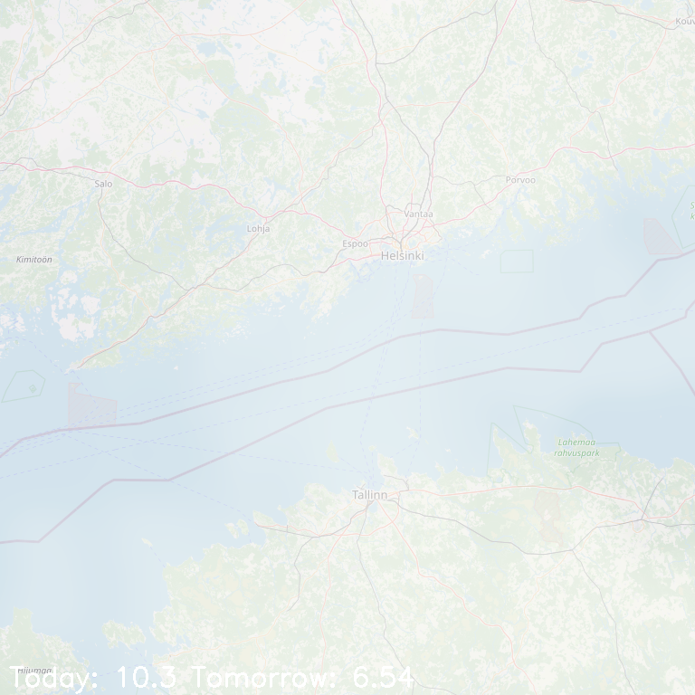

# Open weather viewer
Create a C++ application to generate a weather forecast image. The image will display clouds overlaid on a map representing current weather conditions, along with the current temperature and some forecasted value.

### To build it:
> make

### To run it:
> build/openweather.exe city_name [-v]

### You will see:
build/openweather.exe Espoo

